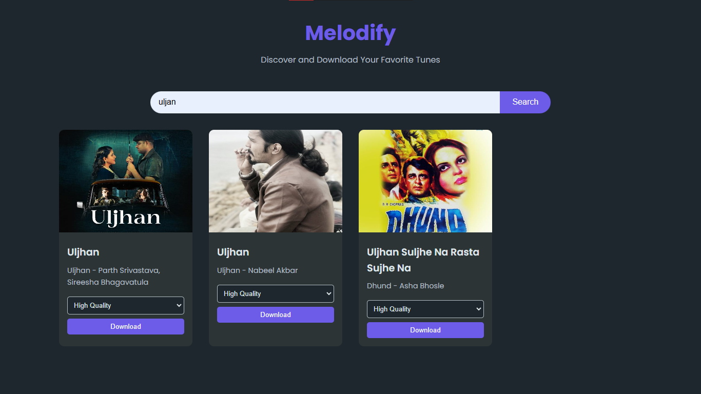

# Metatags Music Downloader


A web application for downloading high-quality music with embedded metatags using the JioSaavn API.




## Features

- Download music in M4A format
- Embed cover image, name, artist, album, and other metadata in the song file
- Support for low to high-quality music downloads
- Responsive design using Tailwind CSS
- Built with Python and Flask
- Uses JioSaavn API for music data
- Mutagen library for metadata embedding

## Installation

1. Clone the repository:
   ```
   git clone https://github.com/yourusername/metatags-music-downloader.git
   cd metatags-music-downloader
   ```

2. Create a virtual environment and activate it:
   ```
   python -m venv venv
   source venv/bin/activate  # On Windows, use `venv\Scripts\activate`
   ```

3. Install the required packages:
   ```
   pip install -r requirements.txt
   ```

4. Set up environment variables (if necessary):
   ```
   cp .env.example .env
   # Edit the .env file with your configuration
   ```

## Usage

1. Start the Flask development server:
   ```
   flask run
   ```

2. Open your web browser and navigate to `http://localhost:5000`

3. Search for a song, select the desired quality, and download

## Contributing

Contributions are welcome! Please feel free to submit a Pull Request.

1. Fork the repository
2. Create your feature branch (`git checkout -b feature/AmazingFeature`)
3. Commit your changes (`git commit -m 'Add some AmazingFeature'`)
4. Push to the branch (`git push origin feature/AmazingFeature`)
5. Open a Pull Request

## License

This project is open source and available under the [MIT License](LICENSE).